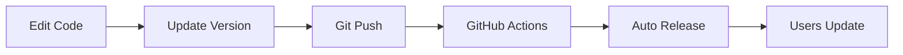

# Developer Guide: Building Claude Code Plugins

> **This guide shows you how to use this repository as a template for building your own Claude Code plugins with automated releases.**

---

## What This Repository Demonstrates

This is a **reference implementation** showing how to:

1. ✅ **Structure a Claude Code plugin** with skills, commands, and scripts
2. ✅ **Automate releases with GitHub Actions** - Version bump → Auto-release
3. ✅ **Handle configuration portably** - Users customize paths without editing code
4. ✅ **Write comprehensive documentation** - Setup wizards, templates, examples
5. ✅ **Develop conversationally** - Natural language plugin development with Claude

---

## The Automated Release Workflow

### How It Works



### Step-by-Step Process

**1. Developer makes changes:**
```bash
# Edit your plugin code conversationally
"Update the publish script to handle network errors"
"Add validation for missing dependencies"
```

**2. Bump version in marketplace.json:**
```json
{
  "metadata": {
    "version": "1.0.1"  // Change from 1.0.0 → 1.0.1
  }
}
```

**3. Commit and push:**
```bash
git add -A
git commit -m "feat: add network error handling"
git push
```

**4. GitHub Actions automatically:**
- ✅ Reads version from `marketplace.json`
- ✅ Creates git tag `v1.0.1`
- ✅ Generates release notes
- ✅ Publishes release

**5. Users get updates:**
```bash
claude plugin update your-plugin-name
```

### GitHub Actions Configuration

See [`.github/workflows/release.yml`](.github/workflows/release.yml):

```yaml
name: Release

on:
  push:
    branches:
      - main
    paths:
      - '.claude-plugin/marketplace.json'  # Only trigger on version changes

jobs:
  release:
    runs-on: ubuntu-latest
    steps:
      - name: Get version from marketplace.json
        run: |
          VERSION=$(jq -r '.metadata.version' .claude-plugin/marketplace.json)

      - name: Create Release
        uses: softprops/action-gh-release@v1
        with:
          tag_name: v$VERSION
          generate_release_notes: true
```

**Key Features:**
- ✅ Only triggers when `marketplace.json` changes (efficient)
- ✅ Version is single source of truth
- ✅ Automatic release notes from commit messages
- ✅ No manual steps required

---

## Use This Pattern for Your Plugin

### 1. Clone This Template

```bash
# Use this repo as a template
git clone https://github.com/ZorroCheng-MC/obsidian-vault-manager-plugin.git my-plugin
cd my-plugin
rm -rf .git
git init
```

### 2. Customize Plugin Structure

```
my-plugin/
├── .github/workflows/
│   └── release.yml              # ✅ Keep as-is (auto-release workflow)
├── .claude-plugin/
│   └── marketplace.json         # ✅ Edit: name, description, version
├── commands/
│   └── your-commands.md         # ✅ Replace with your commands
├── my-skill/                    # ✅ Rename from obsidian-vault-manager
│   ├── SKILL.md                 # ✅ Edit: your skill documentation
│   ├── scripts/                 # ✅ Your scripts here
│   └── templates/               # ✅ Your templates here
└── scripts/
    └── setup.sh                 # ✅ Edit: your setup logic
```

### 3. Develop Conversationally

```bash
# Start Claude in your plugin directory
cd my-plugin
claude

# Talk naturally about what you want to build:
"Create a command that analyzes code complexity"
"Add a script to generate documentation from comments"
"Write tests for the main workflow"
"Review the error handling in setup.sh"
```

**No need for slash commands when developing!** Just describe what you want.

### 4. Release Your Plugin

```bash
# 1. Bump version
vim .claude-plugin/marketplace.json  # 1.0.0 → 1.0.1

# 2. Commit
git add -A
git commit -m "feat: add new feature"

# 3. Push (GitHub Actions handles the rest)
git push
```

**That's it!** Release is automatic.

---

## Repository Structure Explained

```
obsidian-vault-manager-plugin/
├── .github/workflows/
│   └── release.yml              # 🔑 Auto-release workflow
│
├── .claude-plugin/
│   └── marketplace.json         # 🔑 Plugin metadata & version
│
├── commands/                    # Slash commands for users
│   ├── setup.md                 # Interactive setup wizard
│   ├── capture.md               # Example: content capture
│   └── publish.md               # Example: publishing
│
├── obsidian-vault-manager/      # The skill (main functionality)
│   ├── SKILL.md                 # Skill documentation
│   ├── scripts/
│   │   ├── core/                # Core functionality scripts
│   │   └── validation/          # Validation utilities
│   └── templates/               # Content templates
│
├── scripts/
│   └── setup.sh                 # Interactive setup wizard
│
├── examples/.claude/            # Configuration templates
│   ├── settings.local.json.template
│   └── config.sh.template
│
└── docs/                        # Documentation
```

---

## Key Design Decisions

### 1. Configuration Pattern: Config Files (Not Env Vars)

**Problem:** Claude Code's `env` in `settings.local.json` doesn't pass to bash scripts.

**Solution:** Use config files that scripts source:

```bash
# scripts/core/publish.sh
if [[ -f "$PWD/.claude/config.sh" ]]; then
    source "$PWD/.claude/config.sh"
fi

VAULT_PATH="${OBSIDIAN_VAULT_PATH:-$PWD}"
```

**Why it works:**
- ✅ 100% reliable - no env var dependency
- ✅ Portable across different environments
- ✅ User-friendly - setup wizard generates config
- ✅ Has fallback defaults

### 2. Project-Scoped Configuration

**Problem:** Different projects need different settings.

**Solution:** Configuration lives in the project directory:

```
your-vault/.claude/
├── settings.local.json    # Claude Code settings
└── config.sh              # Script configuration
```

**Why it works:**
- ✅ Each vault has its own config
- ✅ Settings don't leak between projects
- ✅ Easy to version control (with .gitignore)

### 3. Interactive Setup Wizard

**Problem:** Manual configuration is error-prone.

**Solution:** `/setup` command that:
- ✅ Detects vault path automatically
- ✅ Checks for dependencies
- ✅ Generates config files
- ✅ Validates setup

See [scripts/setup.sh](scripts/setup.sh) for implementation.

---

## Development Workflow

### As a Plugin Developer

```bash
# 1. Clone your plugin repo
cd ~/Dev/my-plugin

# 2. Start Claude
claude

# 3. Develop conversationally
"Review the setup wizard for edge cases"
"Add error handling to the publish script"
"Refactor the capture command to be more modular"

# 4. Test locally
cd ~/Documents/Obsidian/TestVault
claude
/setup
/your-command

# 5. Release
cd ~/Dev/my-plugin
vim .claude-plugin/marketplace.json  # Bump version
git commit -am "feat: new feature"
git push  # Auto-released!
```

### Testing Your Plugin Locally

Before publishing, test locally:

```bash
# 1. Link your skill for development
ln -sf ~/Dev/my-plugin/my-skill ~/.claude/skills/

# 2. Link your commands
ln -sf ~/Dev/my-plugin/commands/* ~/.claude/commands/

# 3. Test in a project
cd ~/test-project
claude
/your-command
```

---

## Lessons Learned

### ✅ What Works Well

1. **GitHub Actions for auto-release** - Zero-friction releases
2. **Config file pattern** - 100% reliable across environments
3. **Interactive setup wizards** - Great UX for users
4. **Conversational development** - Natural language with Claude CLI
5. **Project-scoped config** - Different settings per project

### ⚠️ Watch Out For

1. **Env vars in settings.local.json** - Don't pass to bash scripts
2. **Hardcoded paths in scripts** - Use config files with defaults
3. **Missing dependencies** - Setup wizard should check everything
4. **Version management** - marketplace.json is single source of truth

---

## Advanced Topics

### Custom MCP Integration

If your plugin needs MCP tools:

```json
// .claude/settings.local.json
{
  "mcpServers": {
    "my-custom-server": {
      "command": "npx",
      "args": ["-y", "my-mcp-package"]
    }
  }
}
```

### Multi-Language Plugins

You can write plugins in any language:

- **Bash**: Simple scripts (like this example)
- **Python**: Data processing, AI integration
- **Node.js**: Web APIs, complex workflows
- **Go**: High-performance tools

Just make sure dependencies are documented in your setup wizard.

### Plugin Distribution

**Option 1: Claude Code Marketplace (Recommended)**
```bash
# Users install via:
claude plugin add your-plugin-name
```

**Option 2: GitHub Direct Install**
```bash
# Users install via:
claude plugin add https://github.com/user/repo
```

---

## Contributing to This Template

Found ways to improve this pattern? PRs welcome!

- 🐛 Report issues with the workflow
- 💡 Suggest improvements to patterns
- 📚 Improve documentation
- 🎨 Share your plugins as examples

---

## Related Resources

- [Claude Code Documentation](https://docs.claude.ai/claude-code)
- [MCP (Model Context Protocol)](https://modelcontextprotocol.io/)
- [GitHub Actions Documentation](https://docs.github.com/en/actions)

---

**💡 Use this pattern to build amazing Claude Code plugins with automated releases!**
